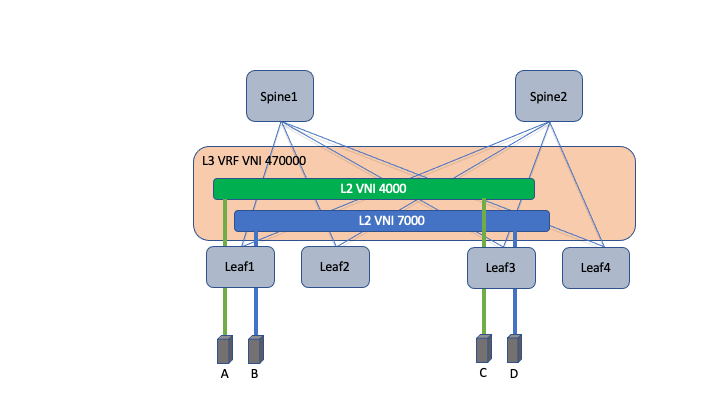

# Cisco DCNM Quick Start Guide

This guide is intended as a quick start guide to accelerate the process of managing DCNM using Ansible.  We provide a step by step process of adding leaf and spine NX-OS devices to an existing vxlan fabric.

# Prerequisites

* DCNM instance running `DCNM Release 11.4(1)` or later.
* Ansible Version `2.9` or later.
* Ansible [DCNM collection version `1.0.0`](https://galaxy.ansible.com/cisco/dcnm) or later.

# Topology

Here is a simple EVPN VXLAN topology that we will reference in this quick start guide.

